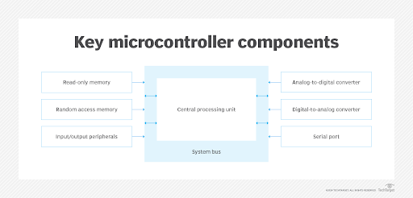
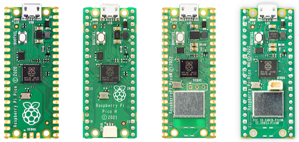
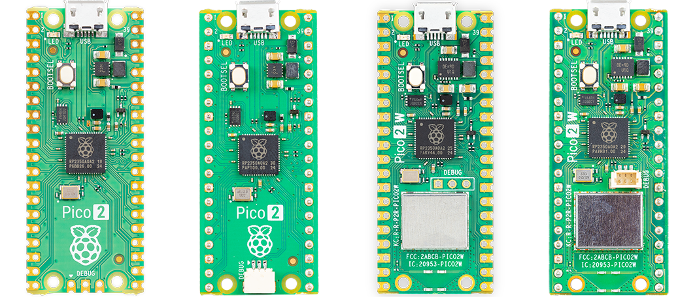
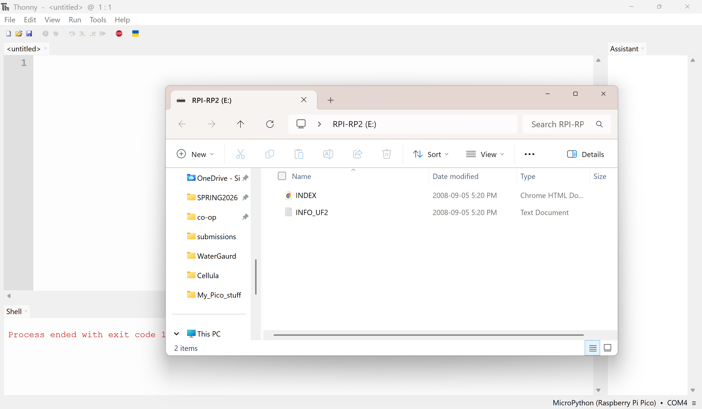
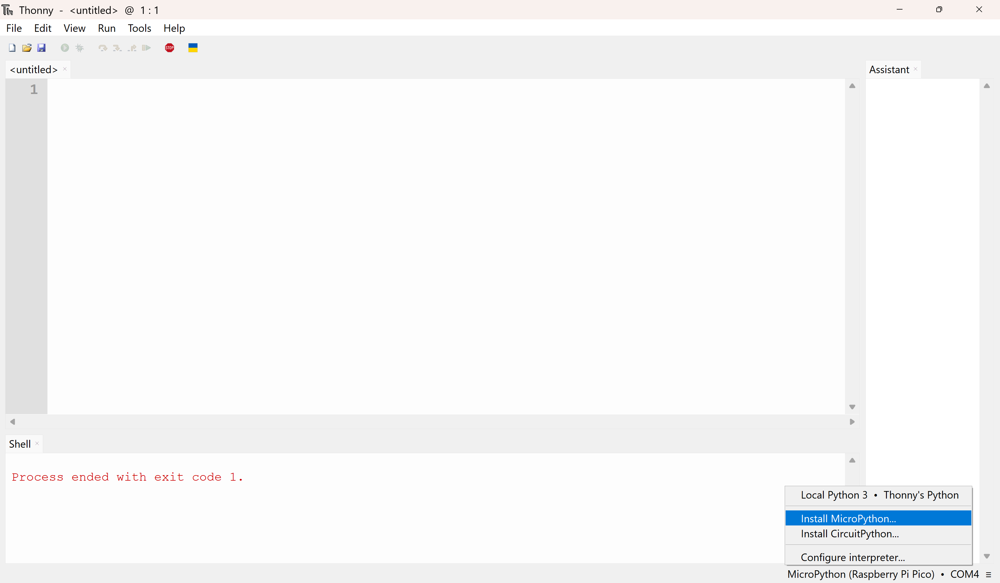
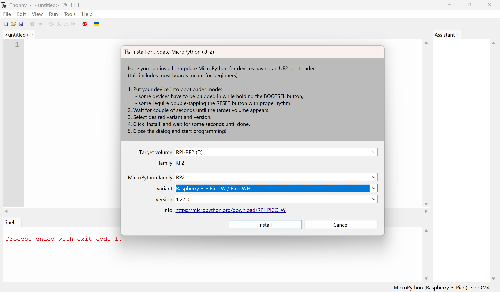
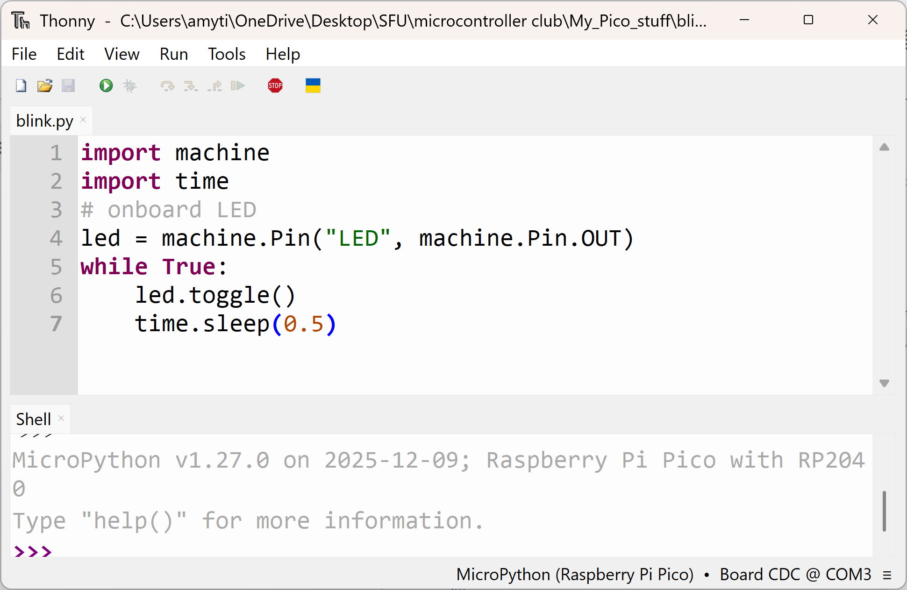
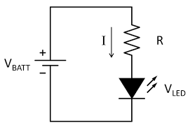

# Back Ground Materials Outline

-   What is a Microcontroller?
-   Microcontroller vs. Computers / Single Board Computers (OS systems)
    -   Discuss bare-metal
-   Microcontroller platforms
    -   Arduino vs. Raspberry Pi Pico vs. STM 32 vs. PIC
-   Micropython vs. C
-   Software Setup
    -   Install Thonny + Flash Pico
-   Electronic Basics
    -   Ohms law - calculate resistors needed!

# What is a Microcontroller?

**Microcontroller/ microcontroller unit (MCU):** a small [computer](https://en.wikipedia.org/wiki/Computer) on a single [integrated circuit](https://en.wikipedia.org/wiki/Integrated_circuit), designed for embedded applications.

-   Generally designed to run a single basic programme repeatedly

## What are the elements of a microcontroller?

\
The core elements that make up a microcontroller are the central
processing unit (CPU), memory and I/O peripherals.

1.  CPU (microprocessor): the brain of the device. It processes and responds to various instructions that direct the microcontroller's function. This involves performing basic arithmetic, logic and I/O operations. It also performs data transfer operations, which communicate commands to other components in the larger embedded system.

2.  Memory: A microcontroller's memory stores the data that the processor receives and uses to respond to instructions it's programmed to carry out. A microcontroller has two main memory types:

    i.  Program memory: This stores long-term information about the instructions that the CPU carries out. Program memory is non-volatile memory, meaning it stores information over time without needing a power supply.

    ii. Data memory: This temporary data storage is used while the instructions are being executed. Data memory is volatile, meaning the data it holds is temporary and is only maintained if the device is connected to a power source.

3.  I/O peripherals: The I/O devices are the interface for the processor to the outside world. The input ports receive information and send it to the processor in the form of [binary](https://www.techtarget.com/whatis/definition/binary) data. The processor receives that data and sends the necessary instructions to output devices, which execute tasks external to the microcontroller.

4.  Other elements: While the processor, memory and I/O peripherals are
    the defining elements of the microprocessor, there are other
    elements that are frequently included. The term I/O peripheral
    refers to a supporting component that interfaces with the memory and
    processor. There are many supporting components that can be
    classified as peripherals. Having some manifestation of an I/O
    peripheral is elemental to a microprocessor because it is the
    mechanism through which the processor functions. Other supporting
    elements of a microcontroller include the following:

-   Analog-to-digital converter. An [ADC](https://www.techtarget.com/whatis/definition/analog-to-digital-conversion-ADC) is a circuit that converts analog signals to digital signals. It lets the processor at the center of the microcontroller interface with external analog devices, such as sensors.

-   Digital-to-analog converter. A DAC performs the inverse function of an ADC, letting the microcontroller's processor communicate its outgoing signals to external analog components.

-   System bus. The system bus is the connective wire that links
    together all components of the microcontroller.

-   Serial port. The serial port is one example of an I/O port that enables the microcontroller to connect to external components. It has a similar function to a [USB](https://www.techtarget.com/whatis/feature/The-history-of-USB-What-you-need-to-know) or a parallel port but differs in the way it exchanges bits.

Sources:

-   [https://en.wikipedia.org/wiki/Microcontroller](https://en.wikipedia.org/wiki/Microcontroller)

-   [https://au.rs-online.com/web/content/discovery/ideas-and-advice/microcontrollers-guide](https://au.rs-online.com/web/content/discovery/ideas-and-advice/microcontrollers-guide)

-   [https://www.techtarget.com/iotagenda/definition/microcontroller](https://www.techtarget.com/iotagenda/definition/microcontroller)

## Microcontroller vs. Computers (OS systems) vs. Single Board Computers (OS systems)

| **Microprocessor (MPU)** | **Microcontroller (MCU)** | **Single Board Computer (SBC)** |
|---|---|---|
| The heart of a computer system | The heart of an embedded system | Microcomputer |
| Memory and I/O components has to be connected externally | Has an external component with an internal memory and I/O components | Has an external component with an internal memory and I/O components |
| Unable to use in compact systems | Able to use in compact system | Able to use in compact system |
| Cost of the system is higher | Cost of the system is lower | Cost of the system is lower |
| Since memory and I/O components are external, each instruction goes through the external operation. Thus it's slower. | Components are internal, where the operation takes place internally, thus it's faster | Components are internal, where the operation takes place internally, thus it's faster |
| Widely used in PC and laptops, big control systems | Widely used in small control systems | Widely used in programming and small control systems |

| | **MCU → bare-metal** | **SBC** | **Computers** |
|---|---|---|---|
| **Examples** | Arduino, ESP32, Raspberry Pi Pico, STM32 | Raspberry Pi, BeagleBone, NVIDIA Jetson Nano | Laptop, Desktop PC |
| **Processing** | Designed for simple, dedicated tasks. Processing capability is low but highly optimized for efficiency. | Much more powerful, capable of handling complex operations and multitasking. | Full general-purpose computing. Very high, designed for complex applications. |
| **Memory & Storage** | Very limited resources, typically measured in kilobytes (KB) or a few megabytes (MB). | Offers significantly more memory and storage, often in gigabytes (GB), suitable for running full applications. | Several GB--TB + storage: SSD/HDD (hundreds of GB or TB) |
| **Operating System** | Usually runs without an operating system or uses minimal firmware for basic control (bare-metal). | Supports full operating systems like Linux, enabling a wide range of software and tools. | Runs full OS (Windows, macOS, Linux) |
| **Power** | Extremely low power requirements, ideal for battery-powered or energy-sensitive devices. | Higher power draw and requires a stable power source for reliable operation. | High (tens--hundreds of W) |
| **Cost** | Very affordable, typically priced between £2 and £20. | More expensive, starting around £30 and going well over £100 depending on specifications. | Much more expensive |
| **Pros** | - Extremely low power consumption - Affordable and widely available - Great for real-time control and simple tasks | - Powerful processing and multitasking - Runs full operating systems - Ideal for networking and advanced projects | |
| **Cons** | - Limited processing power - No operating system - Not suitable for complex applications | - Higher power requirements - More expensive - Overkill for simple tasks | |

Bare Metal Concept: eliminates the intermediary layers of operating systems, allowing developers to interact directly with the hardware.

-   Pros:
    -   Maximizes Resource Utilization by eliminating OS overhead
    -   Predictable performance - good for applications with precise timing
    -   Reduced Complexity - removes the need to navigate the OS

-   Cons:
    -   Limited abstraction - have to deal with hardware-specific details
    -   Portability challenges - program tied to hardware architecture
    -   No standardization

Sources:

-   [https://www.rapidonline.com/news/microcontrollers-vs-sbcs](https://www.rapidonline.com/news/microcontrollers-vs-sbcs)

-   [https://www.seeedstudio.com/blog/2020/10/27/all-about-cpus-microprocessor-microcontroller-and-single-board-computer/](https://www.seeedstudio.com/blog/2020/10/27/all-about-cpus-microprocessor-microcontroller-and-single-board-computer/)

-   [https://intechhouse.com/blog/what-is-bare-metal-programming-in-embedded-system/](https://intechhouse.com/blog/what-is-bare-metal-programming-in-embedded-system/) (bare metal)

## Microcontroller platforms

-   **Arduino boards** (ATmega series) - Popular among hobbyists and makers, Arduino boards use ATmega microcontrollers. They're easy to program, have a large community and are ideal for prototyping projects like [robotics](https://www.rapidonline.com/research-robotics), IoT devices and automation.

-   **Raspberry Pi Pico (RP2040)** - The Pico uses the RP2040
    microcontroller developed by Raspberry Pi. It's inexpensive,
    powerful, and supports both MicroPython and C/C++. It's commonly
    used for embedded learning, robotics, and sensor-based projects.

-   **PIC microcontrollers** - Produced by Microchip Technology, PIC microcontrollers are known for their reliability and versatility. They're widely used in industrial control systems, consumer electronics and automotive applications.

-   **STM32 series** - Based on ARM Cortex cores, STM32 microcontrollers offer high performance and low power consumption. They're commonly used in advanced applications like medical devices, drones and complex embedded systems.

### Raspberry Pi Pico versions:

**H extension** - means that the pins are already soldered

| **Pico** | **Pico W** (were using this) | **Pico 2** | **Pico 2 W** |
|---|---|---|---|
| - RP2040 microcontroller - Dual-core ARM Cortex-M0+ - 133 MHz CPU - 264 KB SRAM - 2 MB flash - 26 GPIO pins - ADC, PWM, I²C, SPI, UART | Pico + - 2.4 GHz Wi-Fi - Bluetooth support - Infineon CYW43439 radio chip | Pico + improved performance: - dual **Cortex-M33 cores** (or RISC-V cores) - **150 MHz clock** - **520 KB RAM (≈2× more)** - **4 MB flash** - more PWM and PIO capability - improved security (TrustZone) | Pico 2 + - RP2350 microcontroller - Wi-Fi 802.11n - Bluetooth 5.2 - same pinout as previous Pico boards |
| - basic embedded learning - robotics - sensor projects | - IoT - web servers - wireless sensors | | - IoT devices - wireless robotics - cloud-connected sensors |

| **Board** | **MCU** | **CPU** | **RAM** | **Flash** | **Wireless** |
|---|---|---|---|---|---|
| Pico | RP2040 | Dual ARM Cortex-M0+ @ 133 MHz | 264 KB | 2 MB | ❌ |
| Pico W | RP2040 | Dual ARM Cortex-M0+ @ 133 MHz | 264 KB | 2 MB | Wi-Fi + Bluetooth |
| Pico 2 | RP2350 | Dual Cortex-M33 or RISC-V @ 150 MHz | 520 KB | 4 MB | ❌ |
| Pico 2 W | RP2350 | Dual Cortex-M33 or RISC-V @ 150 MHz | 520 KB | 4 MB | Wi-Fi + Bluetooth |

 

Sources:

-   [https://www.rapidonline.com/news/microcontrollers-vs-sbcs](https://www.rapidonline.com/news/microcontrollers-vs-sbcs)

-   [https://www.raspberrypi.com/documentation/microcontrollers/pico-series.html](https://www.raspberrypi.com/documentation/microcontrollers/pico-series.html)

## Micropython vs. C

| **Feature** | **MicroPython** | **C/C++ (Pico SDK)** |
|---|---|---|
| Ease of Use | High (Interpreted, REPL support) | Moderate (Requires compilation) |
| Setup Time | Fast (Drag & drop UF2) | Slower (CMake, Toolchains) |
| Performance | Sufficient for most DIY/IoT | Maximum (up to 250x faster) |
| Control | High-level abstraction | Direct register/hardware access |
| Debugging | Print statements / REPL | SWD / Debug probes / GDB |

## Software Setup

1.  Install Thonny IDE from: [https://thonny.org/](https://thonny.org/)

2.  Open Thonny, go to tools→ options → Interpretter

3.  Select Micropython (Raspberry Pi Pico)

4.  Hold the BOOTSEL button

5.  Plug the Pico into USB.

6.  Flash with Thonny

\
the Pico should pop up as a drive like this.

\
Press install MicroPython for the backend.

\
Select appropriate version.

(Or you can drag the [MicroPython .uf2 file](https://www.raspberrypi.com/documentation/microcontrollers/micropython.html) onto the RPI-RP2 drive manually)

7.  The Pico reboots.

8.  Run the following to flash the onboard LED:

## Electronic Basics

-   Ohms law : **V = I R**

\$R = \frac{V_s - V_f}{I_f}$\
- $V_s$ = 3.3 V (out from Pico)
- $V_f$ ≈ 2 V (for LED - I just searched it up)
- $I_f$ ≈ 20 mA (for LED - I just searched it up)\
--> $R = \frac{3.3 - 2}{0.02}$ = 65 Ohm \
we choose closest available value (I used 100 ohms)

### Pull-up and Pull-down Resistors
- buttons with gpio

### Voltage Divider
- photoresistor reading ADC requires it

Sources:
- [https://eepower.com/resistor-guide/resistor-applications/pull-up-resistor-pull-down-resistor/#](https://eepower.com/resistor-guide/resistor-applications/pull-up-resistor-pull-down-resistor/#)

