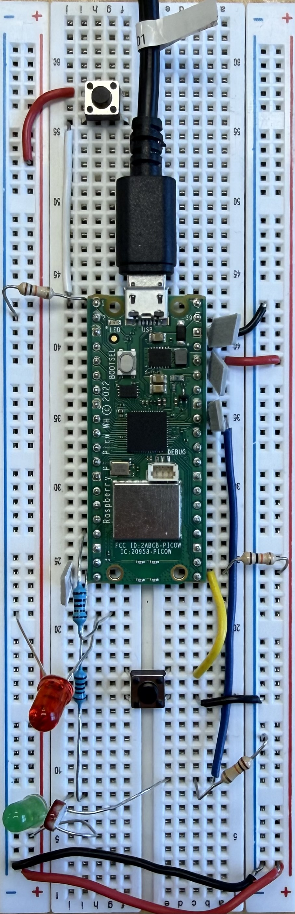

# Pico Beginner Workshop
This repository will serve as the resource center for Pico Beginner workshop hosted on March 13/2026 as a part of Pi Day with the Engineering Science Student Society (ESSS).

## Outline
**Back Ground Materials**
1. What is a Microcontroller? 
2. Microcontroller vs. Computers / Single Board Computers (OS systems)
3. Arduino vs. Raspberry Pi Pico vs. STM 32 vs. PIC
4. Micropython vs. C
5. Software Setup
Hands-on Tutorial
6. Electronic Basics
7. What is GPIO\
**Tutorials** 
1. blink the LED
2. button control
3. Reaction timer - Who has the fastest reaction time!\
***Extra (If time allows):***
1. PWM
2. Read from the photoresistor
3. Ambient light program (adjust PWM based on photoresistor value)
4. Button interrupt

## Results

| Demo Board Layout |
|-------|
|  | 

### Common Beginner Problems

1. Pico stuck in weird state
→ unplug and replug

2. Wrong pin numbering
→ use GP numbers, not board pin numbers

3. sleep() missing argument
→ LED only blinks once

4. Button not powered
→ add pull-up or pull-down resistor

5. Breadboard rows misunderstood
→ check electrical connections

6. Wiring errors
→ verify LED polarity and resistor placement

