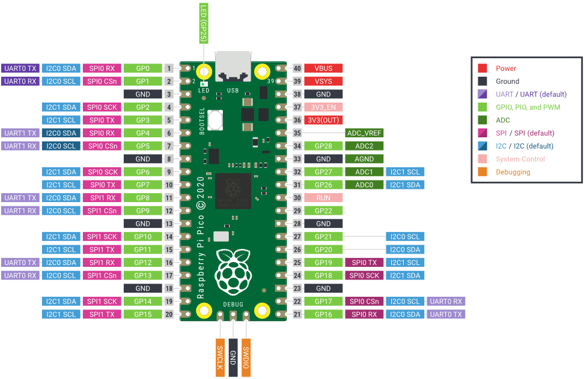
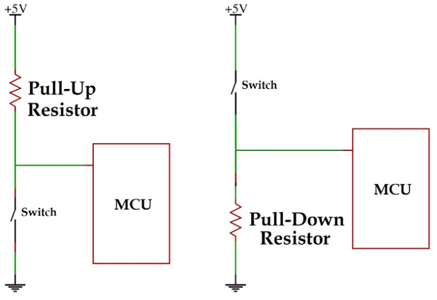

# Hands-On Tutorials
---

  

Raspberry Pi Pico Board Pinout 

---

## Blink LED

- Wire up an LED to a GPIO pin  
- Write a MicroPython program to blink the LED  
- Play with blink timing  

**Suggested Circuit**

- GPIO → LED → Resistor → GND  
- Resistor: **220 Ω**

---

## Set-up Button

- What are **pull-up** and **pull-down** resistors?  
  *(Look it up — we will discuss it together later!)*

- Wire up a **button to a GPIO pin**
- See if you can **print a message when the button state changes**
- Write a program that **uses the button to control the LED**
- Add more buttons and LEDs and **experiment with the functionality**

### Pull-Up and Pull-down Configuration

- Pull-up default state: **1**
- Pull-down default state: **0**

---

## Challenge: Reaction Timer Game

Write a program that:

- Waits a **random delay**
- Turns **on the LED**
- Records **how fast the button was pressed** after the LED turns on
- Prints the **reaction time in the console**
- Keeps track of the **best reaction time of the session**

---

# Challenge: Automatic Light Control

- Wire a **photoresistor (LDR)** to an **ADC pin**  
  *(Use a voltage divider)*

- Write a program that:

  - Reads **light levels** from the photoresistor using the ADC
  - Adjusts the **brightness of the LED using PWM** based on the light level

- **Bonus:** Add a **manual button override** and experiment!

# Resources
[Quick reference for the RP2](https://docs.micropython.org/en/latest/rp2/quickref.html)\
[MicroPython libraries](https://docs.micropython.org/en/latest/library/index.html)\
[machine — functions related to the hardware](https://docs.micropython.org/en/latest/library/machine.html)\
[time – time related functions](https://docs.micropython.org/en/latest/library/time.html)\
[class Pin – control I/O pins](https://docs.micropython.org/en/latest/library/machine.Pin.html)\
[class PWM – pulse width modulation](https://docs.micropython.org/en/latest/library/machine.PWM.html)\
[class ADC – analog to digital conversion](https://docs.micropython.org/en/latest/library/machine.ADC.html)